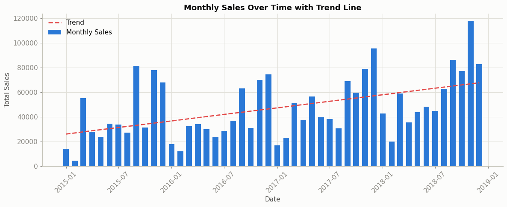

# Superstore Sales Analysis

Business analyst case study on the Kaggle "Superstore" sales dataset (2015-2018):
sales trends, regional and category performance, seasonality, and a short-term
sales forecast.



## Key Findings

- Revenue grew **50.3%** from 2015 to 2018, but driven by a handful of strong
  months each year rather than steady month-to-month growth.
- **West and East** regions lead in sales and are growing fastest; **South**
  lags on both.
- **Office Supplies** is the fastest-growing category, despite Technology and
  Furniture having similar total revenue today.
- Revenue is *not* concentrated in a few accounts: the top 10 customers make up
  only 6.8% of total sales.
- Sales peak sharply in September and November-December (back-to-school and
  holiday buying) - more than half of all months actually decline from the
  month before, so growth comes from these peaks, not consistent momentum.

Full write-up, with recommendations: [**REPORT.md**](REPORT.md)

## Project structure

| File | Purpose |
|---|---|
| `overall_performance.ipynb` | Overall exploratory analysis - monthly/yearly trends, growth rates. |
| `segment_analysis.ipynb` | Analysis by region, category/sub-category, and top customers. |
| `trend_timing.ipynb` | Seasonality, fastest/slowest growth by region and category, shipping delays. |
| `forecasting.ipynb` | Simple monthly sales forecast (Holt-Winters exponential smoothing). |
| `streamlit_dashboard/` | Interactive Streamlit dashboard - see below to run it. |
| `REPORT.md` | Business summary of findings and recommendations. |
| `chart_style.py` | Shared matplotlib styling (colors, fonts) used across all notebooks and the dashboard. |
| `metadata.py` | Data dictionary as a Python dict (`METADATA`) - column names, descriptions, and types. |
| `data/supermarket_sales.csv` | The dataset (committed - see below). |
| `requirements.txt` | Python dependencies. |

## Dataset

Source: [Kaggle - rohitsahoo/sales-forecasting](https://www.kaggle.com/datasets/rohitsahoo/sales-forecasting)
(the "Superstore" sales dataset). One row = one line item within an order.

The CSV is committed to this repo (`data/supermarket_sales.csv`) so the notebooks
and dashboard run out of the box - no download needed. To re-fetch a fresh copy
instead:

```bash
kaggle datasets download rohitsahoo/sales-forecasting --unzip
```

See `metadata.py` for a full column-by-column data dictionary.

## Setup

```bash
pip install -r requirements.txt
```

Requires Kaggle API credentials configured (`KAGGLE_USERNAME`/`KAGGLE_KEY` or
`KAGGLE_API_TOKEN` as an environment variable) if you need to re-download the data.

## Dashboard

An interactive Streamlit dashboard (KPIs, region/category filters, the charts
above) lives in `streamlit_dashboard/`. To run it locally:

```bash
cd streamlit_dashboard
streamlit run dashboard.py
```

This opens a browser tab at `http://localhost:8501`.

## Next Steps

Deploy the dashboard (e.g. Streamlit Community Cloud) for a live, shareable link.
